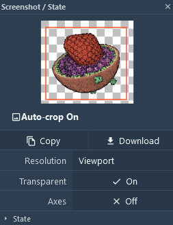
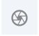
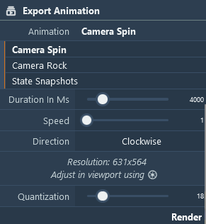
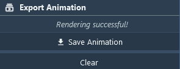
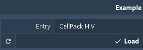
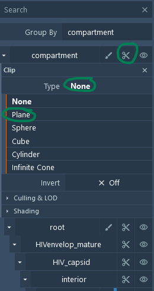
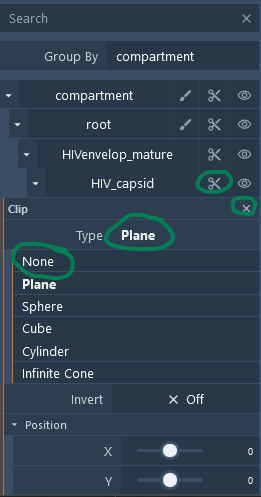
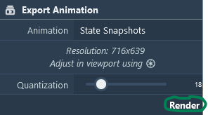


**Images & Movies**

An important functionality of Mol\* and the explorer is the preparation of publication-ready outputs - images or animations 
#### **Images**

Clicking on the toggle Menu in the central top corner you can select the properties of the Image output via . Output image properties can be later selected - Cropping, Resolution (from Viewport, to UltraHD 3840x2160), Transparence, and presence of axes. Other Settings about views such as Camera, Ligthning and Clipping can be set in [Viewport Settings/Control](viewport.md) 

#### **Movies**
It is also possible to export animation to mp4 format. Clicking on the Control Panel next to to the Export Animation. Select animation type and time properties and finally click on the button *Render*.

Once the animation is done rendering click the button *Save Animation* to download the mp4 file. 

##### **Spinning (or Rocking) HIV**

Guide for creating spinning (or rocking) virus videos:

1. Load structure(s)
2. Adjust visual style & coloring
3. Export camera spin (or rock) animation video

Here is a rendition of a rocking HIV:

**Step-by-Step Guide**

To export a rocking HIV video:

- In the Example panel, select the entry *CellPack HIV* and click the *Load* button.

    

- Clip the virus: In the right panel, click the clip icon  at the *compartment* top level. In the new widget that appears, click the Type drop-down and select Plane.

    

- Unclip the capsid: In the right panel, click the clip icon  at the *HIV_capsid* level. In the new widget that appears, click the Type drop-down and select None.

    

- Go to the Export Animation panel.
- Pick the "Camera Spin" (or "Camera Rock") option.
- Optionally, open screenshot settings to adjust the resolution.
- Click "Render".

    

- Wait until the "Save Animation" button appears.

    

- Enjoy and share.

##### **State Snapshots**

See the [Make a Tour](tutorial.md) guide to create the snapshots. Once you have all your snapshots ready:

- Go to the Export Animation panel.
- Pick the "State Snapshots" option.
- Optionally, open screenshot settings to adjust the resolution.
- Click "Render".

    

- Wait until the "Save Animation" button appears.

    

- Here is an example rendered from the [CellPACK HIV tour](https://molstar.org/me/viewer/?example=cellpack-hiv-tour&hide-controls=1).

#### **Final Notes**

- Movie rendering and export are done entirely in the browser. Your data stays on your machine.
- View the states online:
    - HIV: [https://molstar.org/me/viewer/?snapshot-url=https://mesoscope.scripps.edu/explorer/tours/HIV_cut.molx&snapshot-url-type=molx](https://molstar.org/me/viewer/?snapshot-url=https://mesoscope.scripps.edu/explorer/tours/HIV_cut.molx&snapshot-url-type=molx)
    - [Tours](examples.md#examples-of-tours)
