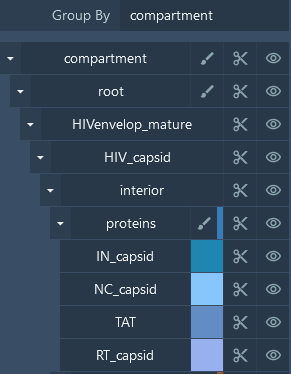
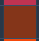
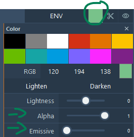
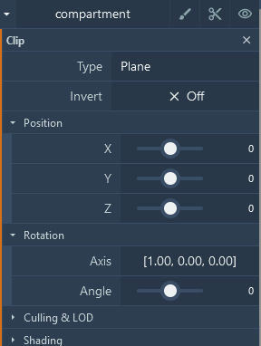
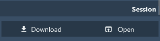

**Common Actions**

The main common actions applied to the viewer consist of changing visibility, color, and clipping of individual or groups of proteins. This is done using the tree view in the right panel. The hierarchy grouping is based on the information available in the input file, and you can find the details here: [file format](fileformat.md). The buttons for visibility , color , and clipping  apply to the current level of the tree and its children.

#### **Visibility**
Clicking  will toggle the visibility of the corresponding entity or group of children on or off.

#### **Color**
Clicking  or  changes the color mode or the actual color of the given entity/group and group children. There are different ways to color structures. At the top level and at the last parent level, you have the following color types:

- Group generated: Generate and apply a main color for each group, and vary the color for each child from that main color.
- Group uniform: Generate and apply a unique color for each group.
- Generate: Generate and apply a different color for each entity.
- Uniform: Apply a unique color to the group.
- Custom: Use the defined protein color.
- Illustrative: Apply the 'illustrative' style to the protein color, which lightens the color according to the atom type.
- Illustrative Chain: Apply the 'illustrative' style to generated chain colors.

At the leaf/protein level, depending on the parent color type, you can change the individual protein color ('custom', 'uniform', 'illustrative').

#### **RGB Color**
Pick a predefined color or manually change the RGB values. Use the 'Lighten' and 'Darken' buttons to adjust the color.

#### **Transparency**
To change the transparency, simply adjust the Alpha value in the color panel.

#### **Emissive**
Make the color emit light with a bloom effect.

#### **Clipping Object**
Clipping cuts or slices away parts of objects from view. There are two ways to manually change the clipping planes using Mol\*:

1. Use Shift + Mouse Wheel to move the front and back clipping planes. On a touchpad, use Shift + two-finger drag.
2. Use the clipping button in the tree panel.

You can apply a clipping object of type Plane, Sphere, Cube, Cylinder, and Infinite Cone and edit its position, rotation, and scale.

#### **Culling/LOD**
For advanced users only, this option lets you customize the LOD (Level of Detail) level and camera distance.

#### **Shading**
Set the rendering to 'approximate' for this node. This improves performance by drawing the sphere as a disk.

#### **Session/State Saving**
Mol\* can save individual sessions or states.

In Plugin State, you can save the current state or session of the view as a .molx file. Saving a session stores not only the description but also input data in a binary .molx file. Sessions/states can be opened either from a local file or from a remote location (e.g., stored on a server).