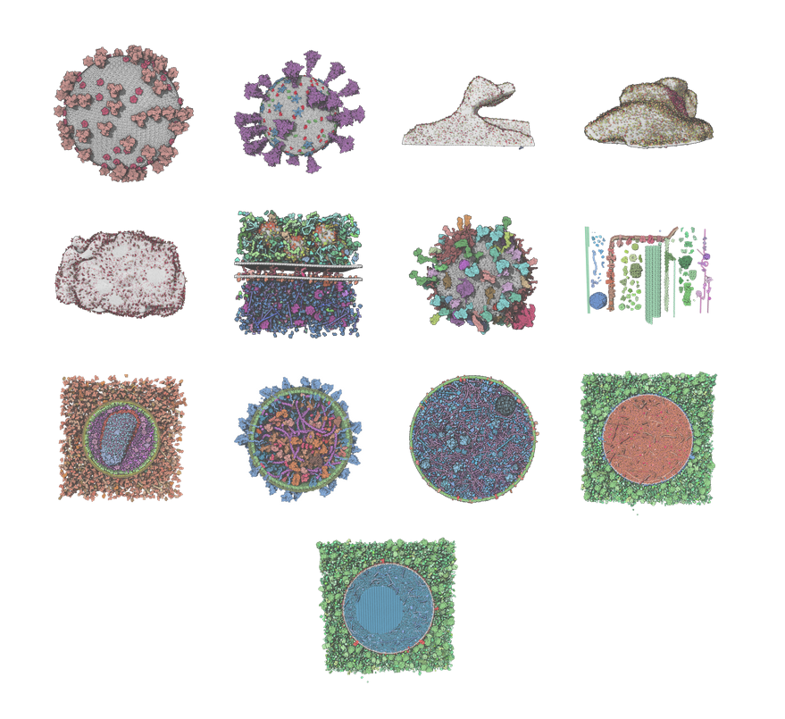
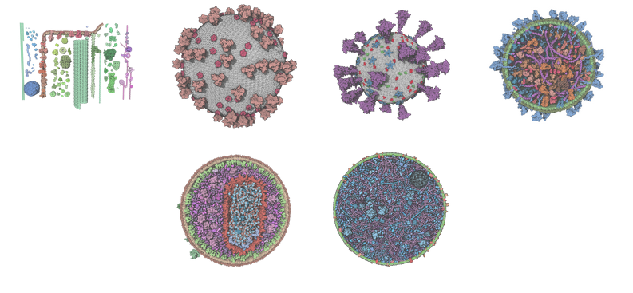

#### Examples of Models

We prepared several use cases that can be accessed from the Mol\* Mesoscale Explorer web page (<https://molstar.org/me/examples/>):

    
    <a style="position: absolute; top: 0%; left: 10%; width: 15%; height: 15%" href="https://molstar.org/me/?example=petworld-hiv&hide-controls=1" target="_blank" rel="noopener noreferrer"><b>HIV</b></a>
    <a style="position: absolute; top: 0%; left: 30%; width: 15%; height: 15%" href="https://molstar.org/me/?example=petworld-sarscov2&hide-controls=1" target="_blank" rel="noopener noreferrer"><b>SARS-CoV-2</b></a>    
    <a style="position: absolute; top: 0%; left: 50%; width: 15%; height: 15%" href="https://molstar.org/me/?example=petworld-postsynmushroom&hide-controls=1" target="_blank" rel="noopener noreferrer"><b>Postsynapse</b></a>    
    <a style="position: absolute; top: 0%; left: 75%; width: 15%; height: 15%" href="https://molstar.org/me/?example=petworld-postsynstubby&hide-controls=1" target="_blank" rel="noopener noreferrer"><b>Postsynapse</b></a>        
    <a style="position: absolute; top: 25%; left: 10%; width: 15%; height: 15%" href="https://molstar.org/me/?example=petworld-presynapse&hide-controls=1" target="_blank" rel="noopener noreferrer"><b>Presynaptic</b></a>    
    <a style="position: absolute; top: 25%; left: 30%; width: 15%; height: 15%" href="https://molstar.org/me/?example=petworld-syngap&hide-controls=1" target="_blank" rel="noopener noreferrer"><b>Synaptic</b></a>    
    <a style="position: absolute; top: 25%; left: 50%; width: 15%; height: 15%" href="https://molstar.org/me/?example=petworld-synvesicle&hide-controls=1" target="_blank" rel="noopener noreferrer"><b>vesicle</b></a> 
    <a style="position: absolute; top: 25%; left: 75%; width: 15%; height: 15%" href="https://molstar.org/me/?example=machineryoflife&hide-controls=1" target="_blank" rel="noopener noreferrer"><b>Machinery</b></a>           
    <a style="position: absolute; top: 47%; left: 10%; width: 15%; height: 15%" href="https://molstar.org/me/?example=cellpack-hiv1&hide-controls=1" target="_blank" rel="noopener noreferrer"><b>HIV</b></a>              
    <a style="position: absolute; top: 47%; left: 30%; width: 15%; height: 15%" href="https://molstar.org/me/?example=cellpack-exosome&hide-controls=1" target="_blank" rel="noopener noreferrer"><b>Exosome</b></a>       
    <a style="position: absolute; top: 47%; left: 50%; width: 15%; height: 15%" href="https://molstar.org/me/?example=cellpack-mg&hide-controls=1" target="_blank" rel="noopener noreferrer"><b>Mycoplasma</b></a>      
    <a style="position: absolute; top: 47%; left: 75%; width: 15%; height: 15%" href="https://molstar.org/me/?example=cellpack-isg_immature&hide-controls=1" target="_blank" rel="noopener noreferrer"><b>immature ISG</b></a>              
    <a style="position: absolute; top: 70%; left: 40%; width: 15%; height: 15%" href="https://molstar.org/me/?example=cellpack-isg_mature&hide-controls=1" target="_blank" rel="noopener noreferrer"><b>mature ISG</b></a>           

- [Petworld HIV virion model](https://molstar.org/me/?example=petworld-hiv&hide-controls=1) consisting of 37.7 million atoms that carries two RNA strands inside the capsid core particle. Authors: Kornel Ozvoldik, Elmar Krieger, and the CellPack team.
- [Petworld model of SARS-CoV-2](https://molstar.org/me/?example=petworld-sarscov2&hide-controls=1). 13 million atoms 976 instances. Authors: Kornel Ozvoldik and Elmar Krieger.
- [Petworld model of the postsynapse](https://molstar.org/me/?example=petworld-postsynmushroom&hide-controls=1) made of 1.4 billion atoms and includes protein filaments, endosomes, and the mitochondrial envelope. Based on previous work by Helm et al. (doi: 10.1038/s41593-021-00874-w).
- [Petworld model of the postsynapse](https://molstar.org/me/?example=petworld-postsynstubby&hide-controls=1) made of 0.9 billion atoms and includes protein filaments and endosomes. Based on previous work by Helm et al. (doi: 10.1038/s41593-021-00874-w).
- [Petworld model of the presynaptic bouton](https://molstar.org/me/?example=petworld-presynapse&hide-controls=1) made of 3.07 billion atoms and includes protein filaments, endosomes, the mitochondrial envelope, and 307 glutamatergic vesicles. Based on previous work by Wilhelm et al. (doi: 10.1126/science.1252884).
- [Petworld synaptic gap](https://molstar.org/me/?example=petworld-syngap&hide-controls=1) model consists of 98.8 million atoms, carrying 10 synaptic vesicles pre-loaded with 8000 glutamates each. Authors: Leticia Alves da Silva, Kornel Ozvoldik, and Elmar Krieger.
- [Petworld synaptic vesicle](https://molstar.org/me/?example=petworld-synvesicle&hide-controls=1) model consists of 3.6 million atoms, carrying 8000 glutamates. Authors: Kornel Ozvoldik and Elmar Krieger.
- [Machinery Of Life](https://molstar.org/me/?example=machineryoflife&hide-controls=1) 3.8 million atoms 475 instances by David Goodsell and Ludovic Autin.
- [CellPack HIV model](https://molstar.org/me/?example=cellpack-hiv1&hide-controls=1) 13.7 million atoms 15313 instances by Ludovic Autin et al.
- [CellPack Exosome](https://molstar.org/me/?example=cellpack-exosome&hide-controls=1) model of 10 million atoms 7766 instances by Julia Jimenez, and Ludovic Autin et al. (doi:10.5210/jbc.v43i2.10331).
- CellPack model of an entire [Mycoplasma genitalium cell](https://molstar.org/me/?example=cellpack-mg&hide-controls=1). 30 million atoms 3740 instances. Authors: Martina Maritan et al. (doi:10.1016/j.jmb.2021.167351).
- [CellPack immature Insulin Secretory Granule](https://molstar.org/me/?example=cellpack-isg_immature&hide-controls=1) and [CellPack mature Insulin Secretory Granule](https://molstar.org/me/?example=cellpack-isg_mature&hide-controls=1). 0.9 billion atoms by Ludovic Autin et al. (doi: 10.1017/qrd.2022.10).

#### Examples of tours

Here are the currently available tour based on available models : 

    
    <a style="position: absolute; top: 0%; left: 10%; width: 15%; height: 30%" href="https://molstar.org/me/?example=machineryoflife-tour&hide-controls=1" target="_blank" rel="noopener noreferrer"><b>Machinery</b></a>
    <a style="position: absolute; top: 0%; left: 30%; width: 15%; height: 30%" href="https://molstar.org/me/?example=petworld-sarscov2&hide-controls=1" target="_blank" rel="noopener noreferrer"><b>HIV</b></a>    
    <a style="position: absolute; top: 0%; left: 50%; width: 15%; height: 30%" href="https://molstar.org/me/?example=petworld-postsynmushroom&hide-controls=1" target="_blank" rel="noopener noreferrer"><b>Sars-cov-2</b></a>    
    <a style="position: absolute; top: 0%; left: 75%; width: 15%; height: 30%" href="https://molstar.org/me/?example=petworld-postsynstubby&hide-controls=1" target="_blank" rel="noopener noreferrer"><b>Exosome</b></a>        
    <a style="position: absolute; top: 45%; left: 30%; width: 15%; height: 30%" href="https://molstar.org/me/?example=petworld-presynapse&hide-controls=1" target="_blank" rel="noopener noreferrer"><b>HIV</b></a>    
    <a style="position: absolute; top: 45%; left: 50%; width: 15%; height: 30%" href="https://molstar.org/me/?example=petworld-syngap&hide-controls=1" target="_blank" rel="noopener noreferrer"><b>Mycoplasma</b></a>   

- [Machinery Of Life](https://molstar.org/me/?example=machineryoflife-tour&hide-controls=1)
- [Petworld HIV virion model](https://molstar.org/me/?example=petworld-hiv-tour&hide-controls=1)
- [Petworld model of SARS-CoV-2](https://molstar.org/me/?example=petworld-sarscov2-tour&hide-controls=1) 
- [CellPack Exosome](https://molstar.org/me/?example=cellpack-exosome-tour&hide-controls=1) 
- [CellPack HIV model](https://molstar.org/me/?example=cellpack-hiv-tour&hide-controls=1)
- [Mycoplasma genitalium cell](https://molstar.org/me/?example=cellpack-mg-tour&hide-controls=1)
