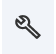
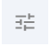

**Getting Started**
[Mol\* Mesoscale Explorer (MME)](https://molstar.org/me/) is built on top of Mol\* and shares many features with it. We refer the reader to the [Mol\* viewer documentation](https://molstar.org/viewer-docs/) for details about the standard viewer. Below you will find specific documentation for MME and related Mol\* viewer documentation.

#### **General Interface**
The user interface is structured with the following components.

#### **1 Left panel**

This menu provides users quick access to:

- Explorer header: Provides general information about the viewer, a link to this documentation, and a button to start a tour with contextual help.
- [Loading feature](fileformat.md): Load PDB, PDB-DEV, cellPACK, Petworld cif files, manifest files, 
- Session download: Download the full current session as a .molx file.
- [Snapshots features](snapshot.md): Add/edit the current list of snapshots/slides and options.
- [Export mp4 animation](Images_Movies.md): Create and export movies of default animations (rock, spin) and snapshot animations.
- Viewport settings: Advanced viewport and rendering settings.

#### **2 Middle panel**

This is the viewer where the model is displayed for manipulation in three dimensions (3D). In the viewer panel, the animation controller is displayed at the top left when there are snapshots. A description text panel appears on the left side of the viewer if a description is provided in the current snapshot. The description can be hidden, and its size can be controlled using the dedicated button. At the top right, this menu provides users with quick access to some commonly used operations for the 3D canvas. It is located towards the right side of the 3D canvas and has the following functions.

|**Function**|**Description**|**Icon**|
| :-: | :-: | :-: |
|*Reset Camera*|Centers and resets the view of the structure on the 3D canvas| |
|[*Screenshot/State Snapshot*](Images_Movies.md)|Takes an image of the structure as shown and gives options for resolution and download| |
|*Controls Panel*|Hides/shows the Controls Panel to the right| |
|[*Settings/Control Info*](viewport.md)|Provides settings for viewing the 3D canvas, as well as information about navigating in 3D and mouse controls| |

The Controls Panel provides quick access to the viewport settings (camera, lighting) and references to the mouse and key behaviors:

- Rotate: Drag using the left mouse button
- Rotate around z-axis (roll): Drag using the left mouse button + control key + shift key
- Pan: Drag using the right mouse button or left mouse button + control key
- Focus: Drag using three fingers
- Focus and zoom: Drag using the wheel/middle mouse button
- Zoom: Scroll using the wheel/middle mouse button
- Clip: Scroll using the wheel/middle mouse button + shift key
- Move forward, back, left, right, up, down: Press w, s, a, d, r, f
- Roll left, right: Press q, e
- Pitch up, down: Press arrow up + shift key, arrow down + shift key
- Yaw left, right: Press arrow left + shift key, arrow right + shift key
- Boost move: Press left shift key
- Enable pointer lock: Press space + control key
- Toggle the click behavior from center to center and focus : Press c

#### **3 Right panel**

- Exposes the model description if any.
- Displays the current selection settings and information. To select, use shift + left click either on the 3D canvas or in the tree hierarchy.
- Measurements: Given the current selection, you can create Label, Distance, Angle, Dihedral, Orientation, and Plane visuals over the current model. See details on [Labeling](measurements.md).
- Quick Styles: Provides different style presets to change the scene appearance. See details [here](quick-styles.md).
- Graphics quality: Options include Ultra, Quality (Default), Balanced, Performance, and Custom.