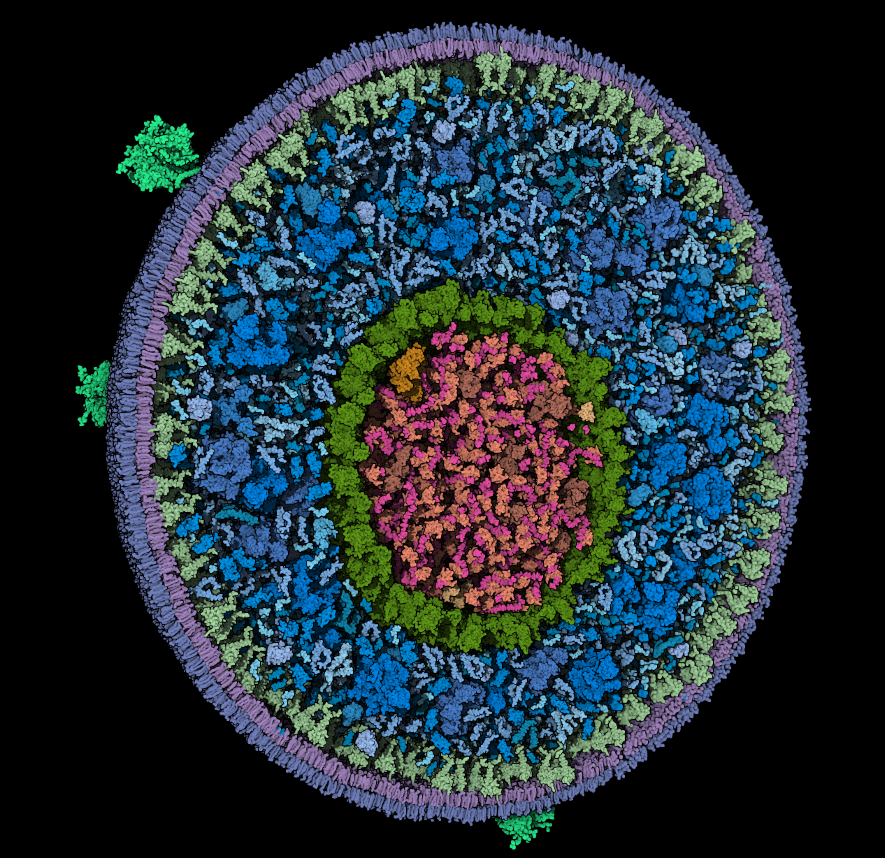
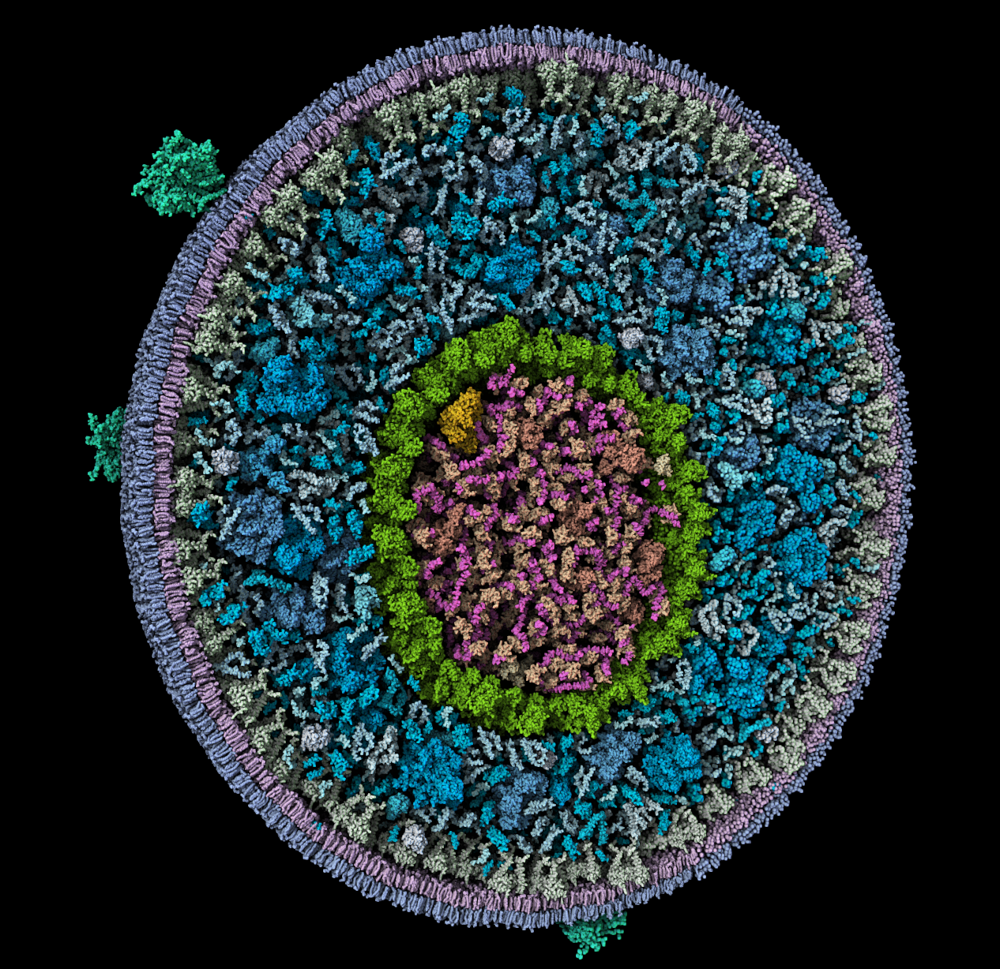
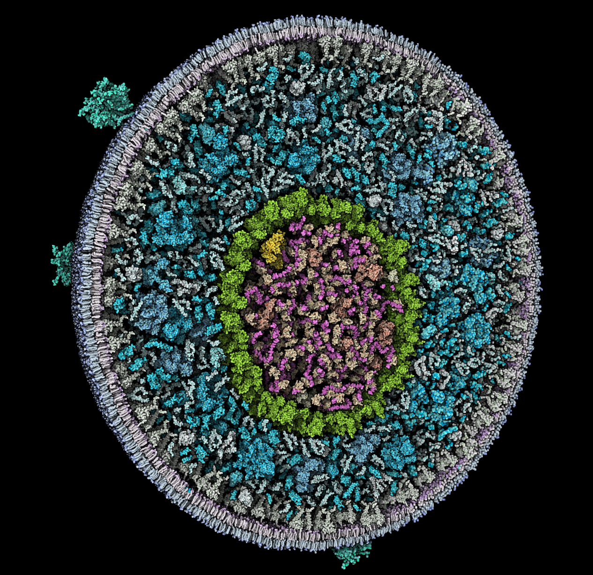
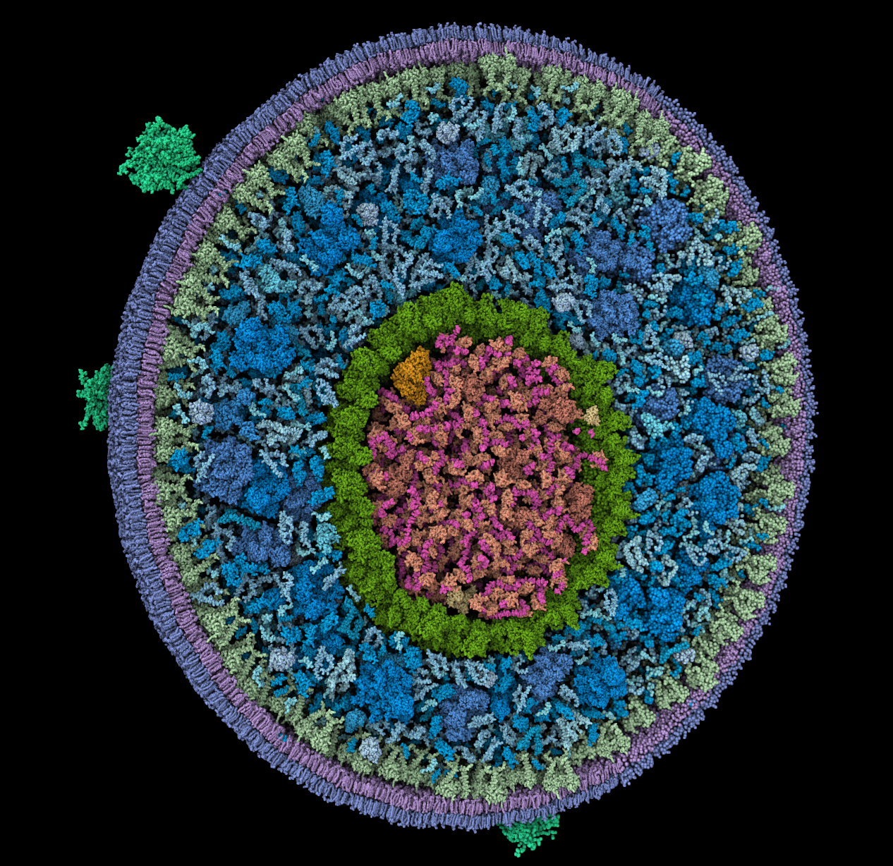
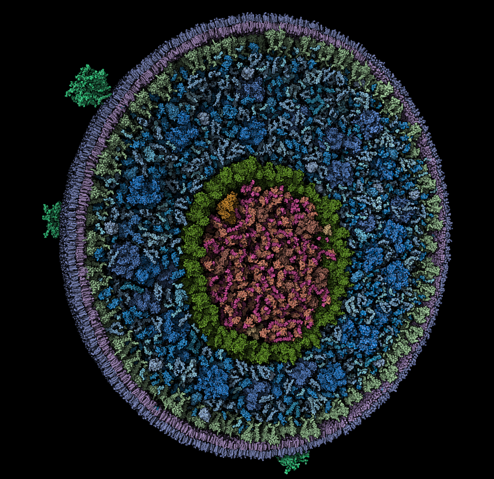
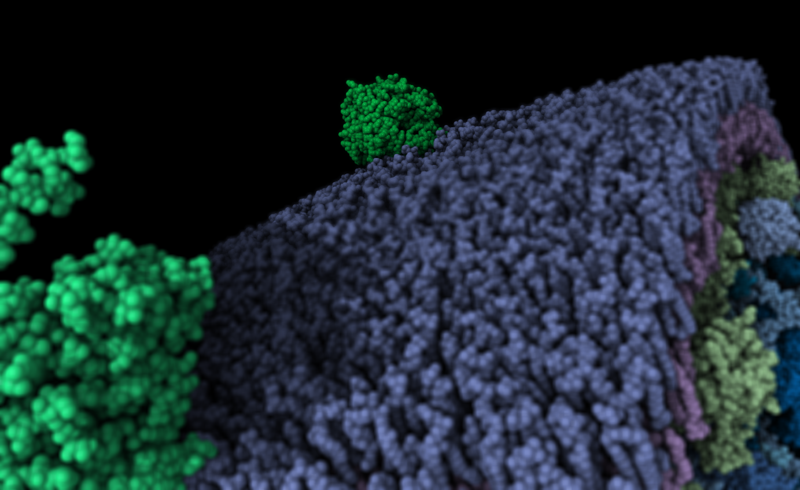

The Quick Styles panel in #ME allows users to swiftly apply different styles to their representations. Below are the available styles and their effects:

## Default

Applies the default representation preset. Sets outline and occlusion effects to their default values.

## Cel-shaded

Applies a cel-shaded or toon shading effect. Removes outline, increases lighting intensity, and enhances occlusion intensity.

## Illustrative

Applies the illustrative representation preset. Enables outline and occlusion effects. Enables ignore-light parameter.

Quickest way to emulate @dsgoodsell`s coloring style.

## Shiny

Adds a glossy finish to the sphere rendering. 

## Shiny-Illustrative

Combines a glossy finish with the illustrative color option.

## Shiny-DOF

Adds gloss and enables the Depth of Field (DOF) effect, focusing on the camera's current target center.

