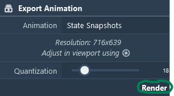

#### **Snapshots**

This panel allows users to manage and configure snapshots for their projects. Snapshots capture the current state of all parameters and data in the explorer (camera, color, visibility, labels, etc.). You can add a snapshot using the `Add` button after optionally providing: 
- **Name** 
- **Key** for easier reference, used in labels to create clickable labels that will load this snapshot. 
- **Descriptions** using Markdown syntaxes, which supports linking to:  
&nbsp;&nbsp;&nbsp;&nbsp;- other snapshots with a given key `[...](#key)` 
&nbsp;&nbsp;&nbsp;&nbsp;- highlight a protein with a given NAME `[...](iNAME)`  
&nbsp;&nbsp;&nbsp;&nbsp;- highlight a group with a given group type and group name `[...](ggrouptype.groupname)` 
&nbsp;&nbsp;&nbsp;&nbsp;- URLs with a given link `[...](http...)` 
 

#### **Snapshot Options** 

Customize the behavior and data captured in each snapshot: 
- *Duration*: Adjust the duration in milliseconds during the animation. 
- *Data*: Toggle to capture the current state of data within the project. 
- *Behavior*: Include any dynamic behaviors or interactions present at the time of the snapshot. 
- *Structure Selection*: Enable to include information about the project's structural components. 
- *Component Data*: Optionally include detailed data about specific components. 
- *Animation*: Capture any ongoing animations within the project scene. 
- *Canvas3D*: Include Canvas3D settings to ensure visual fidelity in snapshots. 
- *Interactivity*: Allow interactive elements to remain functional in snapshots. 
- *Camera*: Maintain the current camera settings and position. 
- *Camera Transition*: Control camera interpolation between snapshots and the duration of the transition. 
 

#### **Snapshot Editing**

After creating one or several state snapshots, it is possible to edit them. From the toolbar next to the snapshot title, you can  open the control to edit and apply changes to the name, key, and description. You can move  snapshots up and  down to change the order in which they will be animated.  Replace the snapshot with the current state (this will overwrite everything for this snapshot). And finally,  delete the snapshot.

#### **Snapshot Animation**
If the snapshot has a description, it will appear in the viewport. The description panel exposes buttons to control visibility and font size. When more than one snapshot is added, an animation player and controls appear on the viewport, allowing the snapshots to be played like a slideshow. Furthermore, the Export Animation widget will be enabled for the State Snapshot animation type, and users can export the animation as an mp4 (see [export a movie](Images_Movies.md#state-snapshots)).

 

