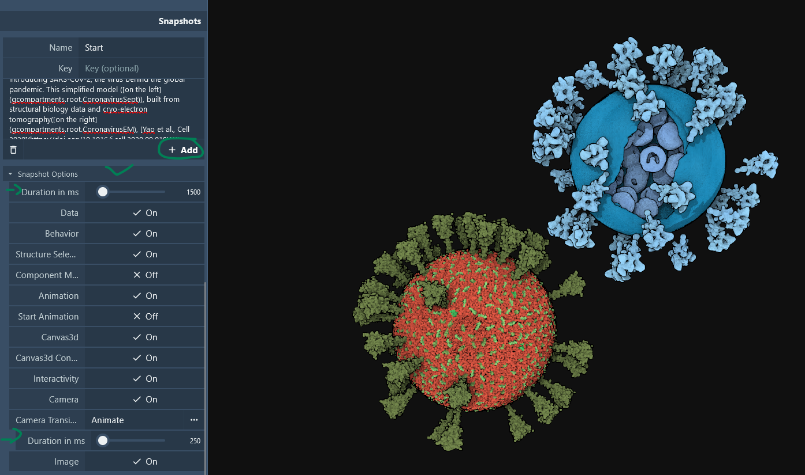
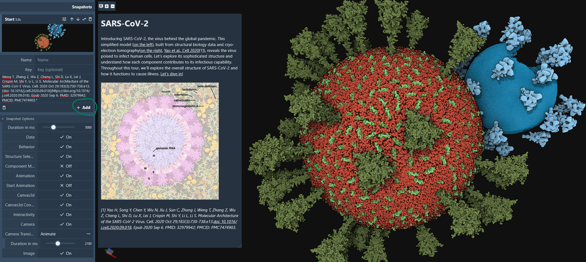
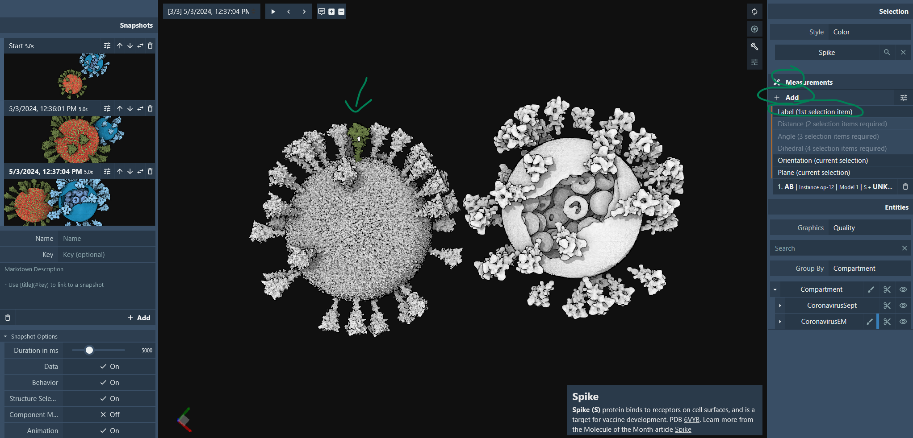
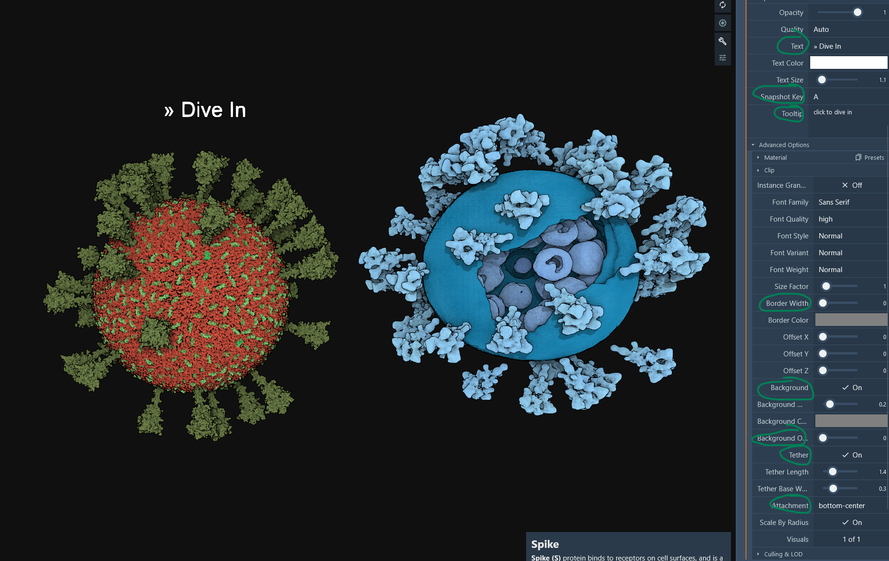
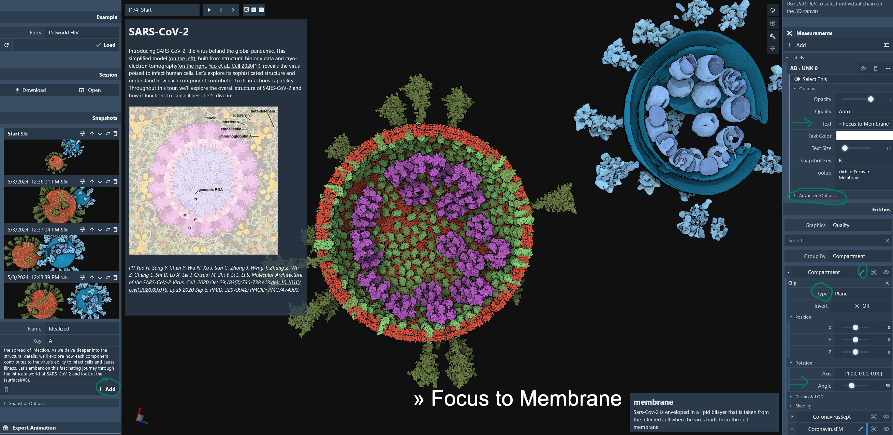
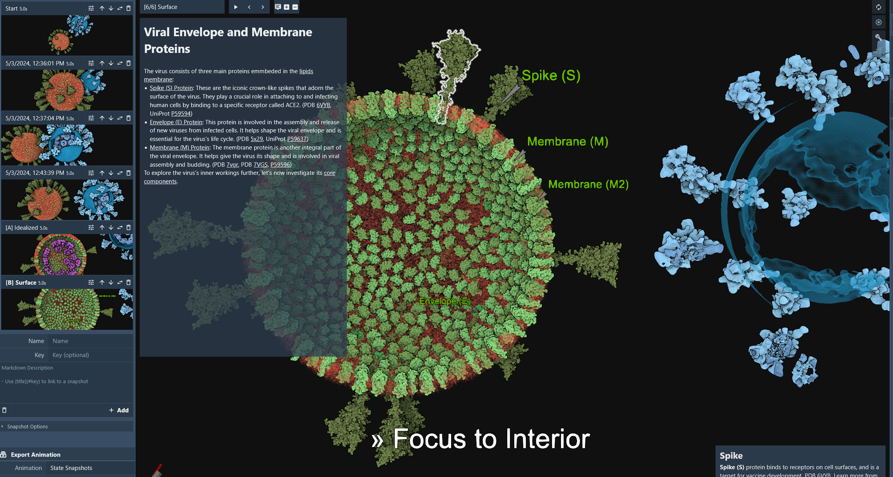
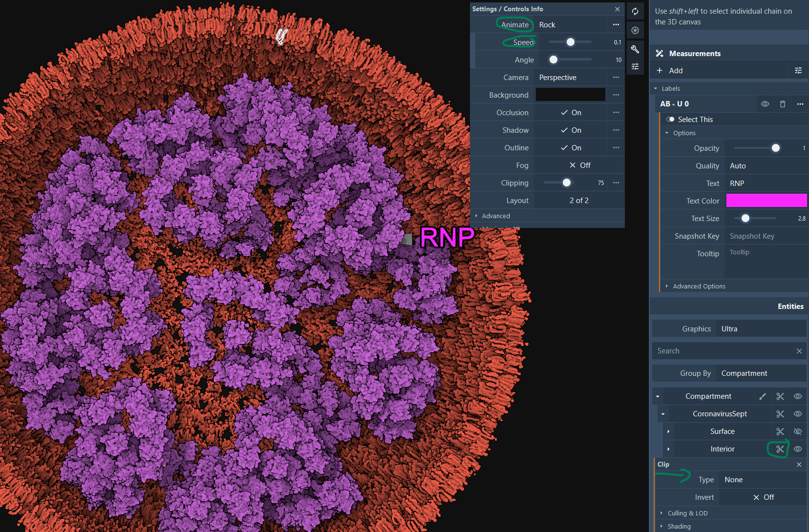

One of the great features of the explorer is the capability to save snapshots to be used to design a guided tour/exploration of a model. Models can come from PetWorld, CellPACK, or any method that can generate cif files defining the protein instances as [biological assemblies](https://pdb101.rcsb.org/learn/guide-to-understanding-pdb-data/biological-assemblies#Anchor-Biol) or using the [generic manifest file format](fileformat.md#manifest-generic-file-format-documentation).

We will use the following [SARS-CoV-2 simple model](https://mesoscope.scripps.edu/explorer/examples/sarscov2_manifest.zip) for this tutorial. It uses the generic manifest file format which supports *'.ply'* mesh objects as well as cif structures. If you are curious, you can unzip the file and look at the *'manifest.json'* file.

The first thing to do is to prepare our storyboard in advance with the textual information for each slide/snapshot. We will build our tour around the following steps: introduction, surface and interior description, finishing with some camera animation.

## Preparation

### 1. Start

Name: Start
Key: AA
Description: 
```markdown
# SARS-CoV-2 

&nbsp;

Introducing SARS-CoV-2, the virus behind the global pandemic. This simplified model ([on the left](gcompartments.root.CoronavirusSept)), built from structural biology data and cryo-electron tomography ([on the right](gcompartments.root.CoronavirusEM), [Yao et al., Cell 2020](https://doi.org/10.1016/j.cell.2020.09.018)[1]), reveals the virus poised to infect human cells [EMD-30430](https://www.ebi.ac.uk/emdb/EMD-30430). Let's explore its sophisticated structure and understand how each component contributes to its infectious capability. Throughout this tour, we'll explore the overall structure of SARS-CoV-2 and how it functions to cause illness. [Let's dive in!](#A)

&nbsp;


&nbsp;

*[1] Yao H, Song Y, Chen Y, Wu N, Xu J, Sun C, Zhang J, Weng T, Zhang Z, Wu Z, Cheng L, Shi D, Lu X, Lei J, Crispin M, Shi Y, Li L, Li S. Molecular Architecture of the SARS-CoV-2 Virus. Cell. 2020 Oct 29;183(3):730-738.e13.[doi: 10.1016/j.cell.2020.09.018](https://doi.org/10.1016/j.cell.2020.09.018). Epub 2020 Sep 6. PMID: 32979942; PMCID: PMC7474903.*
```

### 2. Introduction

Name: DiveIn
Key: A
Description: 
```markdown
# Idealized Model 

&nbsp;

SARS-CoV-2 is composed of several key structural components. These include the [spike (S) protein](iSpike,CryoEM_Spike), [envelope (E) protein](iEnv), [membrane (M) protein](iM_), and [nucleocapsid (N) protein](iNucleocapsid,CryoEM_RNP). Together, these structural components work in harmony to facilitate the virus's entry into host cells, replication of its genetic material, assembly of new viral particles, and ultimately, the spread of infection. As we delve deeper into the structural details, we'll explore how each component contributes to the virus's ability to infect cells and cause illness. Let's embark on this fascinating journey through the intricate world of SARS-CoV-2 and look at the [surface](#B).
```

### 3. Surface

Name: Surface
Key: B
Description: 
```markdown
# Viral Envelope and Membrane Proteins

&nbsp;

The virus consists of three main proteins embedded in the [lipid membrane](imembrane,CryoEM_Membrane):

- [Spike (S) Protein](iSpike,CryoEM_Spike): These are the iconic crown-like spikes that adorn the surface of the virus. They play a crucial role in attaching to and infecting human cells by binding to a specific receptor called ACE2. (PDB [6VYB](http://www.rcsb.org/pdb/explore.do?structureId=6VYB), UniProt [P59594](https://www.uniprot.org/uniprotkb/P59594/entry))

- [Envelope (E) Protein](iEnv): This protein is involved in the assembly and release of new viruses from infected cells. It helps shape the viral envelope and is essential for the virus's life cycle. (PDB [5x29](http://www.rcsb.org/pdb/explore.do?structureId=5x29), UniProt [P59637](https://www.uniprot.org/uniprotkb/P59637/entry))

- [Membrane (M) Protein](iM_): The membrane protein is another integral part of the viral envelope. It helps give the virus its shape and is involved in viral assembly and budding. (PDB [7vgr](http://www.rcsb.org/pdb/explore.do?structureId=7vgr), PDB [7VGS](http://www.rcsb.org/pdb/explore.do?structureId=7VGS), [P59596](https://www.uniprot.org/uniprotkb/P59596/entry))

To explore the virus's inner workings further, let's now investigate its [core components](#C).
```


### 3. Interior

Name: Interior
Key: C
Description: 
```markdown
# Internal Structural Organization

&nbsp;

Inside the virion, the Nucleocapsid (N) protein binds to the genome RNA ([Ribonucleoprotein RNP](iNucleocapsid,CryoEM_RNP)), supporting the dense packing of the long RNA strand essential for the virus's replication and transmission. The RNA strand carries the genetic information vital for the virus's reproduction within host cells. Understanding this RNA is key to unraveling the virus's replication process.

This model is based on the latest cryoET of the virion. See [Yao et al., Cell 2020](https://doi.org/10.1016/j.cell.2020.09.018)[1] and [Saville et al.](https://pubs.acs.org/doi/10.1021/acs.chemrev.1c01062)[2].


 
*[1] Yao H, Song Y, Chen Y, Wu N, Xu J, Sun C, Zhang J, Weng T, Zhang Z, Wu Z, Cheng L, Shi D, Lu X, Lei J, Crispin M, Shi Y, Li L, Li S. Molecular Architecture of the SARS-CoV-2 Virus. Cell. 2020 Oct 29;183(3):730-738.e13. [doi: 10.1016/j.cell.2020.09.018](https://doi.org/10.1016/j.cell.2020.09.018). Epub 2020 Sep 6. PMID: 32979942; PMCID: PMC7474903.*

*[2] Saville JW, Berezuk AM, Srivastava SS, Subramaniam S. Three-Dimensional Visualization of Viral Structure, Entry, and Replication Underlying the Spread of SARS-CoV-2. Chem Rev. 2022 Sep 14;122(17):14066-14084. [doi: 10.1021/acs.chemrev.1c01062](https://doi.org/10.1021/acs.chemrev.1c01062). Epub 2022 Jul 21. PMID: 35863749; PMCID: PMC9344915.*
```

## Make Snapshots
Open the [explorer](https://molstar.org/me/viewer/) in a browser and load the [SARS-CoV-2 simple model](https://mesoscope.scripps.edu/explorer/examples/sarscov2_manifest.zip). In this section, we will first create 4 snapshots to provide a smooth camera animation that highlights the model, followed by one snapshot highlighting the membrane and one snapshot highlighting the interior.

### 1. Set Default Durations and Create the Initial Snapshot
First, change the default duration for snapshots to 5000 milliseconds and the camera animation to 2100 milliseconds.
Use the information from [1-Start](tutorial.md#1-start) to fill in the fields for adding a snapshot. Click the *+Add* button to create the snapshot.



### 2. Create a Zoomed-In Snapshot
Copy the description from [1-Start](tutorial.md#1-start) into the description field for a new snapshot, but leave the key empty. Change the camera view to zoom in on the virus model on the left and click the *+Add* button.



### 3. Create a Snapshot for the Segmented Virus
Repeat the process, but with the camera pointing to the segmented virus on the right. For the final snapshot, zoom back to see both viruses and add a label. Select one of the spikes of the model, then add a new measurement of type *Label*.



### 4. Adjust Snapshot Options
Once created, change the options as shown in the images below. Copy the description again and add the snapshot.



### 5. Add a Focus Label for the Membrane
Change the label text to '» Focus on Membrane', change the Key to B, and set the attachment to *top-center*. Click  at the top level in the hierarchy tree and select a plane. Rotate the plane to -50°. Use the information from [2-Introduction](tutorial.md#2-introduction) to fill in the fields and add the snapshot.



### 6. Add a Focus Label for the Interior
Change the label text to '» Focus on Interior' and change the Key to C. Hide the interior by toggling the visibility  of the 'interior' level and CryoEM_RP in the hierarchy tree. Make the membrane semi-transparent by clicking the color icon and adjusting the transparency/alpha to 0.5. Pick one protein instance per protein type to create a tethered label. Write the protein name for the text, change the color, and add a tether.



### 7. Final Adjustments
Toggle the visibility  of the 'interior' level and CryoEM_RP back on in the hierarchy tree. Disable the plane clipping  at the 'interior' level and toggle off the visibility for the surface proteins, 'surface' and CryoEM_Spike. Restore the transparency of the membrane (alpha=1.0). Hide or delete all current labels and add a label for the RNP. Change the graphics quality to *Ultra*. Click in the viewport  to open the settings, set the animation to *Rock*, and change the speed to 0.2.



### Rendering of the tour 


### View the tour 
[https://molstar.org/me/viewer/?url=https://mesoscope.scripps.edu/explorer/tours/makeatour.molx&type=molx&hide-controls=1](https://molstar.org/me/viewer/?url=https://mesoscope.scripps.edu/explorer/tours/makeatour.molx&type=molx&hide-controls=1)

