#### Main Settings
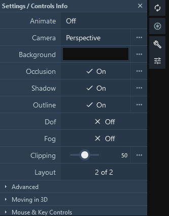
 This panel allows fine-tuning of the viewport rendering effects and camera options: 
- **Animate**: Rock (shortcut `o`) or Spin (shortcut `i`) the camera around the current pivot (camera center) at a given speed and angle 
- **Camera**: Perspective or Orthographic camera projection. Hide/Show the Axes. Enable Stereo rendering 
- **Background**: Change the Background Color 
- **Occlusion**: Enable/Disable Ambient Occlusion 
- **Shadow**: Enable/Disable Shadow 
- **Outline**: Enable/Disable Outline 
- **DoF**: Enable/Disable Depth Of Field 
- **Fog**: Enable/Disable Fog 
- **Clipping**: Adjust camera front clipping plane 
- **Layout**: Enable/Disable the Left and Right panel visibility 

 

##### Ambient Occlusion
Ambient occlusion is a shading and rendering technique used to calculate how exposed each point in a scene is to ambient lighting. In molecular graphics, this technique enhances the perception of depth and shape of molecules. In Mol\*, the effect is achieved using the screen space ambient occlusion (SSAO) algorithm. The SSAO algorithm is implemented as a pixel shader, analyzing the scene depth buffer which is stored in a texture for which we can control the *Resolution Scale*. For every pixel on the screen, the pixel shader samples the depth values between the *Near* and *Far threshold* around the current pixel at a given *Radius* and tries to compute the amount of occlusion from each of the sampled points. The final occlusion factor can be adjusted using a *Bias* and is applied by mixing the given *Color*. This effect is not sufficient for large scenes with different objects of different scales. This is why we added the **Multi Scale** option, which can apply the SSAO effect for different levels of Radius and Bias.

SSAO                       |  Multiscale SSAO
:-------------------------:|:-------------------------:
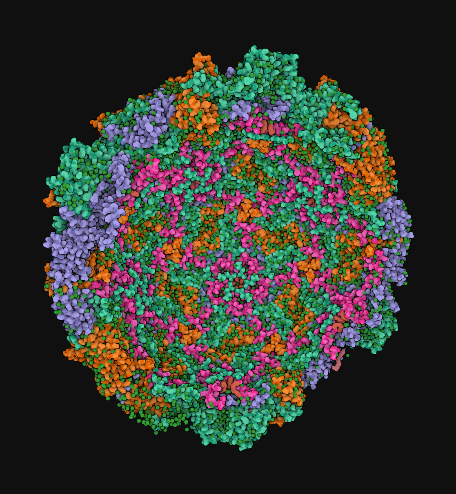  |  
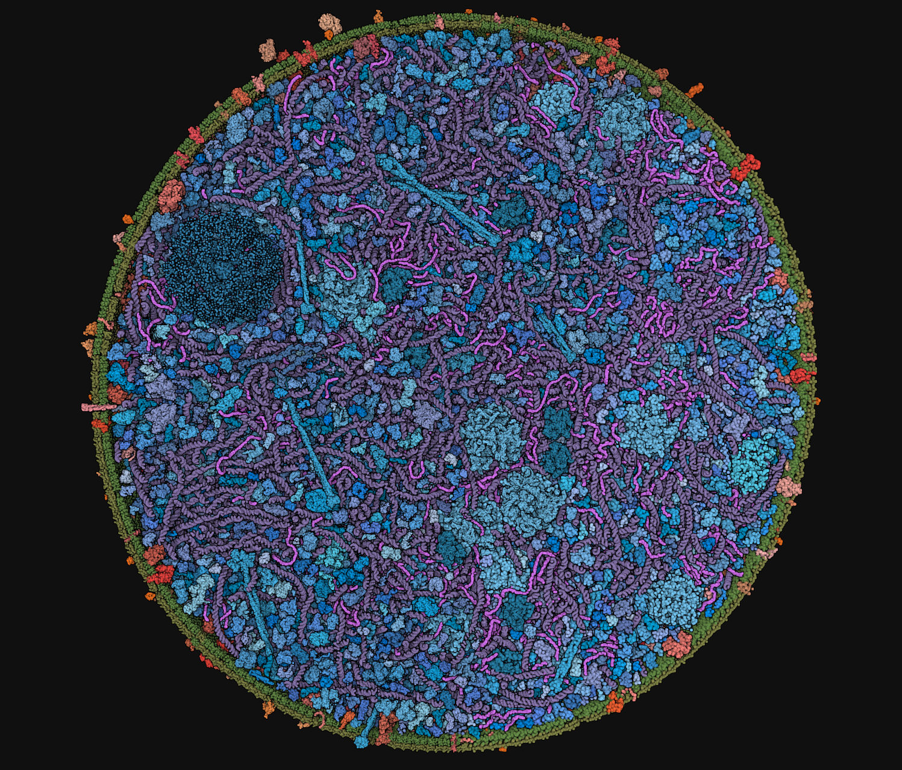  |  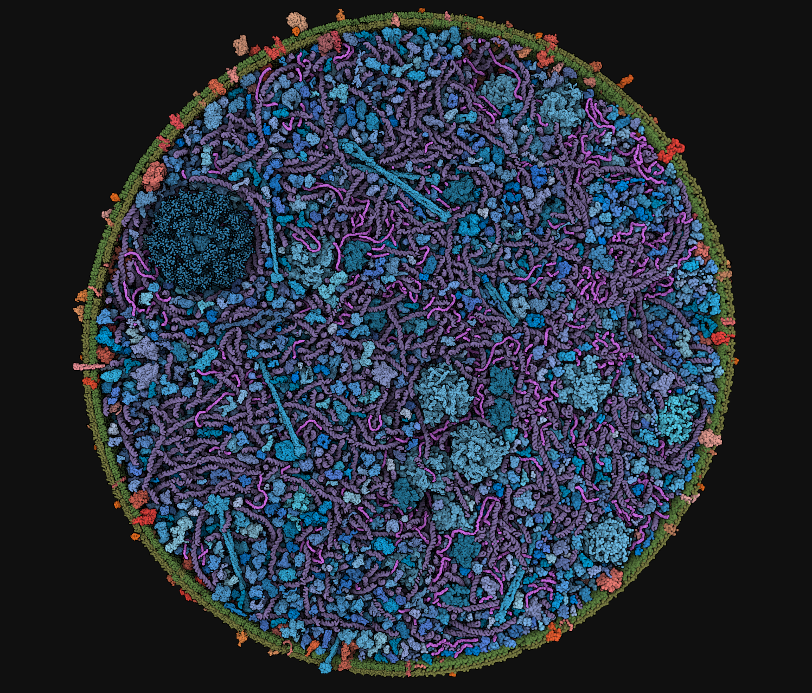
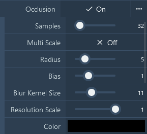  |  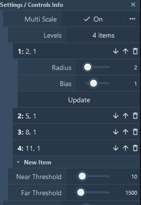

##### Shadow
The shadow in Mol\* is a screen space effect like the SSAO. Our implementation is greatly inspired by [Panos Karabelas](https://panoskarabelas.com/posts/screen_space_shadows/), who detailed the basic idea as follows: We start by moving from the pixel to the light. We move in steps; in each step, we compare the depth of our ray against the depth that the camera perceives. If our ray depth is larger (further away) from the camera’s, then we assume that the pixel is in shadow.

 
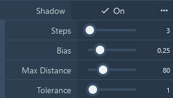
 
The following options are exposed: 
- **Steps**: How many pixels are sampled along the path between the pixel and the light distance 
- **Bias**: Strength of the shadow 
- **Max distance**: The maximum distance to cover in the direction of light 
- **Tolerance**: Depth difference threshold 

*Note that the light settings are accessible in the advanced viewport settings->Renderer->Light->Inclination|Azimuth|Color|Intensity.*

 
Here is an example showing a rendering with shadow only, 64 steps, 0.81 bias, and a distance of 256.

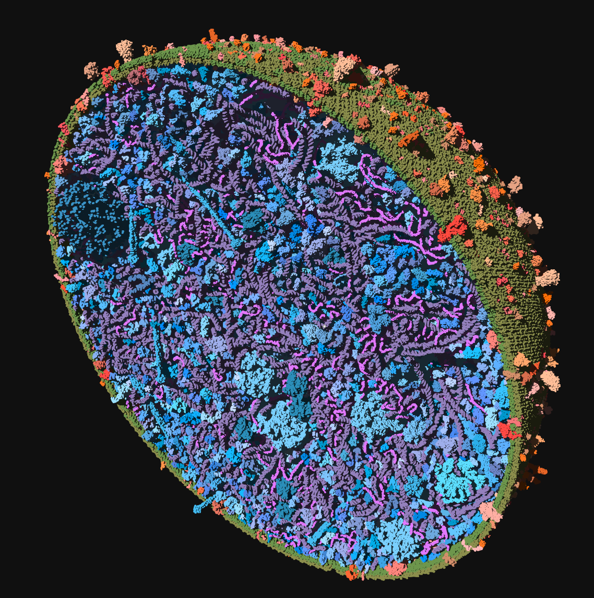

##### Outline

The outline effect draws a colored line at abrupt changes of normal and depth. This gives a contouring effect for which we can adjust its Scale (thickness), Threshold (sensitivity), and Color.

 

Threshold 0.1 Black contour |  Threshold 0.6 Yellow contour
:-------------------------:|:-------------------------:
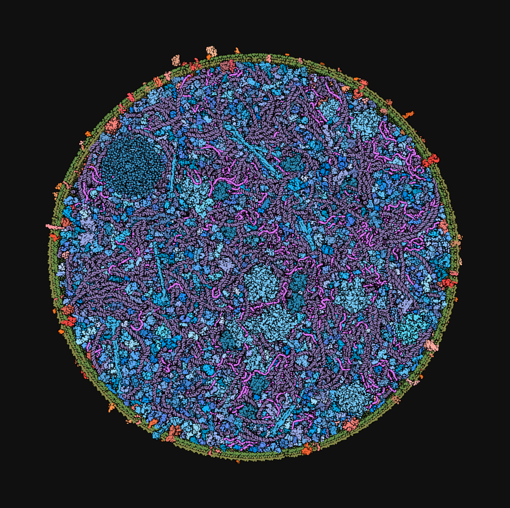  |  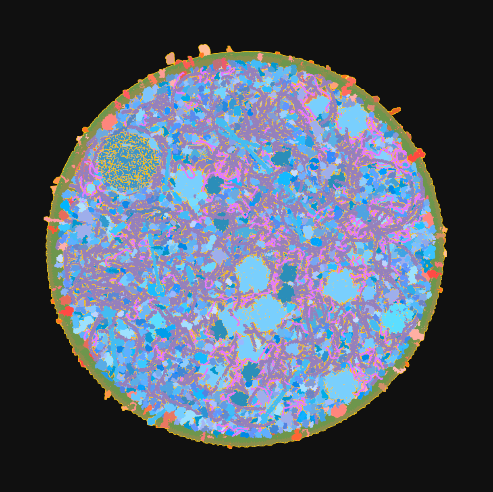

##### Depth Of Field
The depth of field is the distance between the nearest and the furthest objects that are in acceptably sharp focus in an image captured with a camera. To fake this visual effect, we implemented a simplified [screen space algorithm](https://catlikecoding.com/unity/tutorials/advanced-rendering/depth-of-field/) that evaluates the distance of the pixel from the sharp point of focus, which is either the scene bounding box center or the camera pivot point. The distance test can be done in a sphere or against a plane.

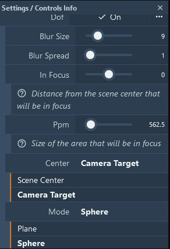
- **Blur size**: Controls the number of pixels of the blurring box 
- **Blur spread**: Controls the scale of the blurring box 
- **In Focus**: Used in planar mode to define the distance from the plane passing through the Center 
- **Ppm**: The size of the area in focus (plane thickness or sphere radius) 
- **Center**: The center of the focused area, either the scene center or the current camera target (default) 
- **Mode**: How the focus distance is computed. In planar mode:  `focus = (abs(distance_to_center_Z) - InFocus) / PPM;`  and in spherical mode:  `focus = distance_to_center / PPM;` 

 

Planar DOF |  Spherical DOF
:-------------------------:|:-------------------------:
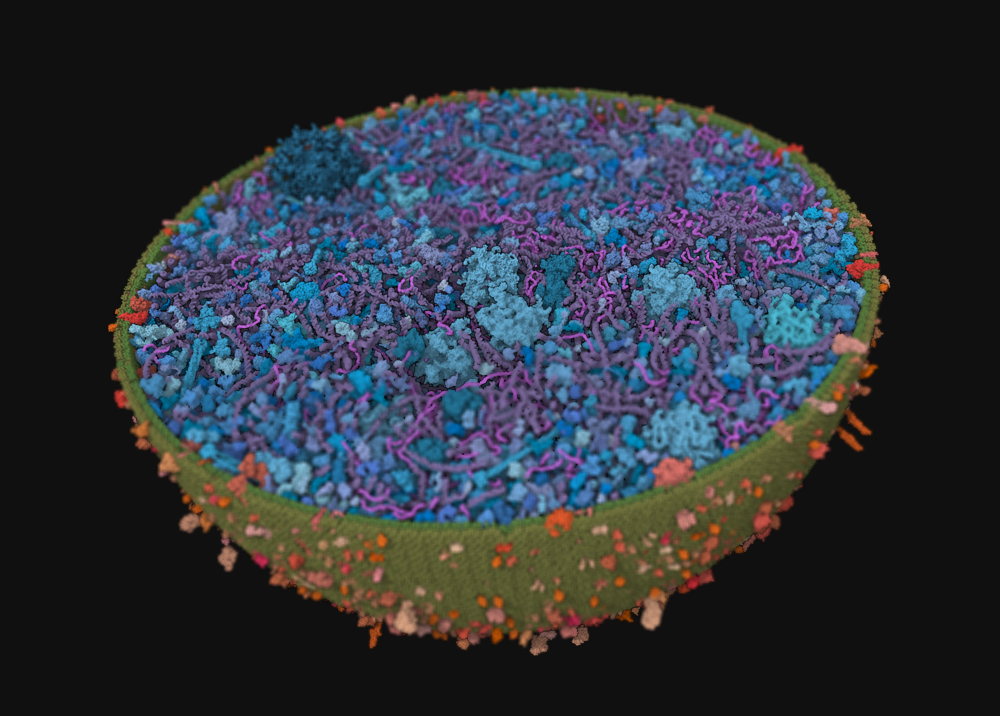  |  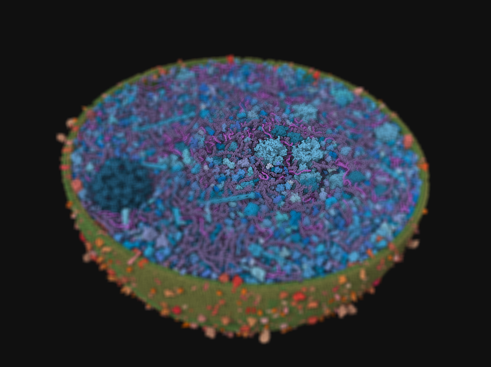

##### Fog
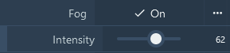
Also called depth cue, it helps to emphasize what is in the foreground and background of the image with respect to the camera by adding a progressive fog of a given intensity based on the depth value.  
 

#### Advanced Settings
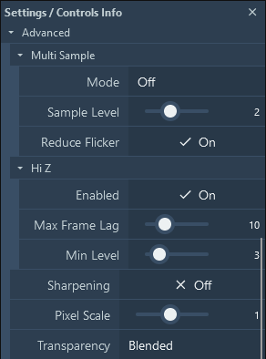
 
This panel provides advanced settings for fine-tuning the rendering and performance of the viewer: 
- **Multi Sample** 
&nbsp;&nbsp;&nbsp;&nbsp;- **Mode**: Toggle between different multi-sampling modes. On, Off, Temporal. 
&nbsp;&nbsp;&nbsp;&nbsp;- **Sample Level**: Adjust the level of multi-sampling. Higher levels provide better quality at the cost of performance. Take level^2 samples. 
&nbsp;&nbsp;&nbsp;&nbsp;- **Reduce Flicker**: Enable or disable flicker reduction in "temporal" mode. 
- **Hi Z** Hierarchical Z-buffer occlusion culling. Only available for WebGL2. 
&nbsp;&nbsp;&nbsp;&nbsp;- **Enabled**: Toggle Hi Z on or off. This improves rendering performance by using a hierarchical Z-buffer. 
&nbsp;&nbsp;&nbsp;&nbsp;- **Max Frame Lag**: Adjust the maximum frame lag. This sets the upper limit on how many frames the Hi Z buffer can lag behind the current frame. 
&nbsp;&nbsp;&nbsp;&nbsp;- **Min Level**: Adjust the minimum level for Hi Z. This sets the lower bound for the depth levels considered by Hi Z. 
- **Sharpening** Contrast Adaptive Sharpening 
&nbsp;&nbsp;&nbsp;&nbsp;- **Enabled**: Toggle sharpening on or off. This improves the visual clarity by enhancing edges. 
&nbsp;&nbsp;&nbsp;&nbsp;- **Pixel Scale**: Adjust the pixel scaling factor. This controls the intensity of the sharpening effect. 
- **Transparency** 
&nbsp;&nbsp;&nbsp;&nbsp;- **Mode**: Choose the transparency mode. Options include Blended, Weighted and Depth Peeling. 

 

#### Moving in 3D
References to the mouse and key behaviors in the viewer:

- **Rotate**: Drag using the left mouse button
- **Rotate around z-axis (roll)**: Drag using the left mouse button + control key + shift key
- **Pan**: Drag using the right mouse button or left mouse button + control key
- **Focus**: Drag using three fingers
- **Focus and zoom**: Drag using the wheel/middle mouse button
- **Zoom**: Scroll using the wheel/middle mouse button
- **Clip**: Scroll using the wheel/middle mouse button + shift key
- **Move forward, back, left, right, up, down**: Press w, s, a, d, r, f
- **Roll left, right**: Press q, e
- **Pitch up, down**: Press arrow up + shift key, arrow down + shift key
- **Yaw left, right**: Press arrow left + shift key, arrow right + shift key
- **Boost move**: Press left shift key
- **Enable pointer lock**: Press space + control key

#### Mouse and Key Controls
References to the mouse and key controls in the viewer:

- **Spin Animation**: Press i
- **Rock Animation**: Press o
- **Toggle Fly Mode**: Press space + shift key
- **Reset View**: Press t
- **Camera center**: Click element using left mouse button
- **Camera center and focus**: Click element using right mouse button
- **Click**: Click element using left mouse button
- **Toggle select**: Click element using left mouse button + shift key or left mouse button + control key
- **Highlight**: Hover over element using mouse hover + shift key or mouse hover + control key
